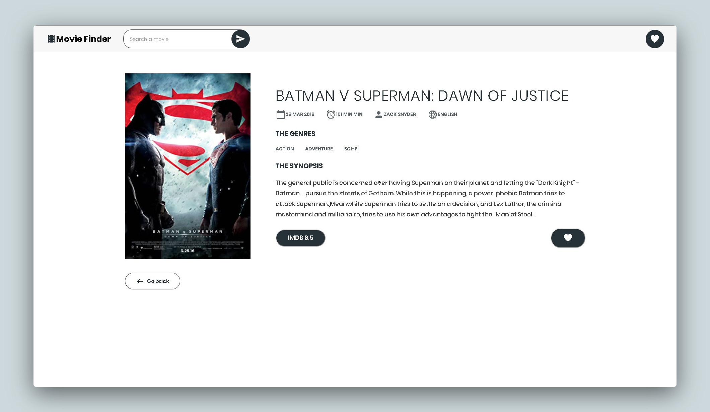
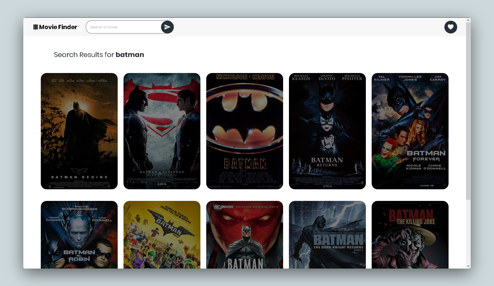

## Movie Library  Project  using JavaScript

[Check It Live Here](https://moviefinder19.netlify.app/)  

------






**In** order to use this project

- Create an Account in the OMDB Site  [link](https://www.omdbapi.com/)  

- Create a config.js file at public/src and paste your proxy and APIKEY
 ```js
  export const API_KEY = YOUR APIKEY;
  export const PROXY = PROXY;
  ```

  

**Getting Started**

Install the dependencies

```
npm install
```


Run the code in the command line

```
npm run dev
```


Open the link in the browser

```
http://localhost:3000/
```

