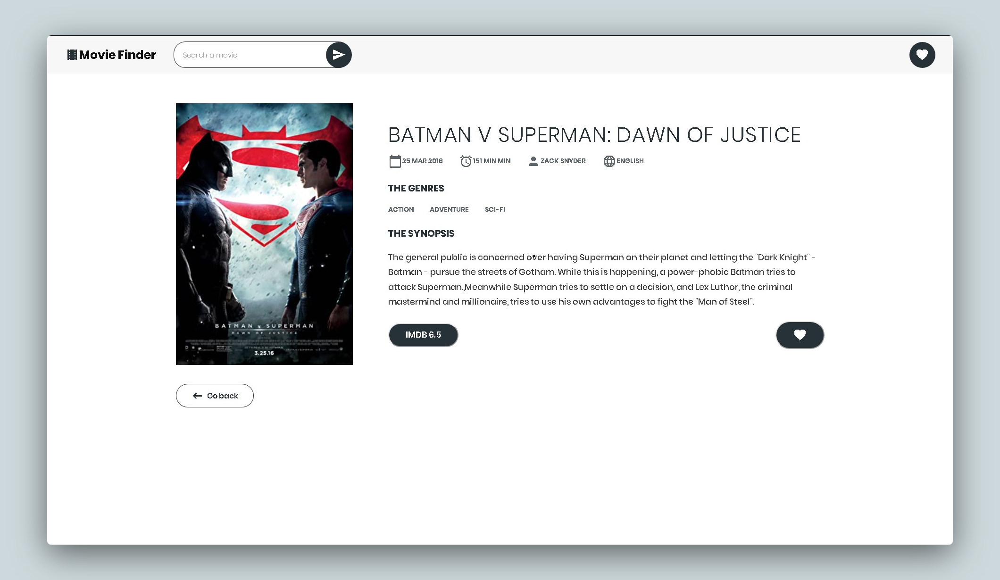
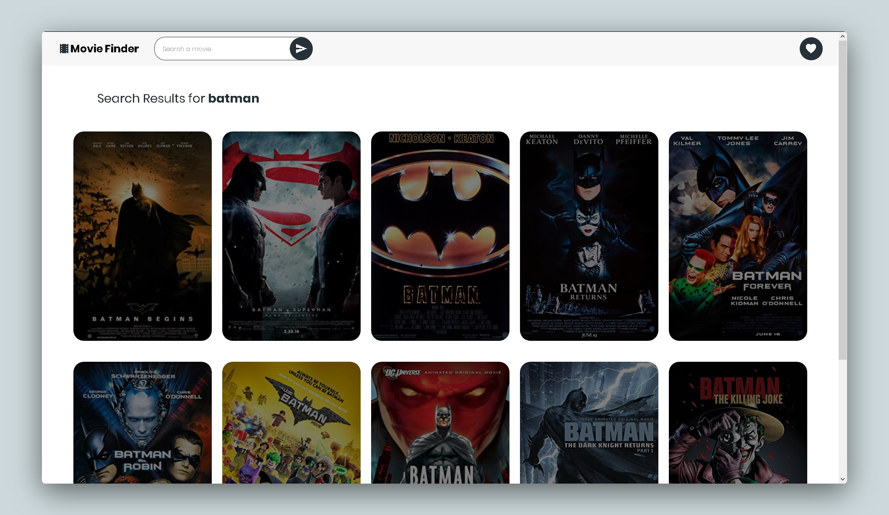

## Movie Library  Project  using JavaScript

[Check It Live Here](https://moviefinder19.netlify.app/)  





**Getting Started**

Install the dependencies

```
npm install
```

Run the code in the command line

```
npm run dev
```


Open the link in the browser

```
http://localhost:3000/
```

